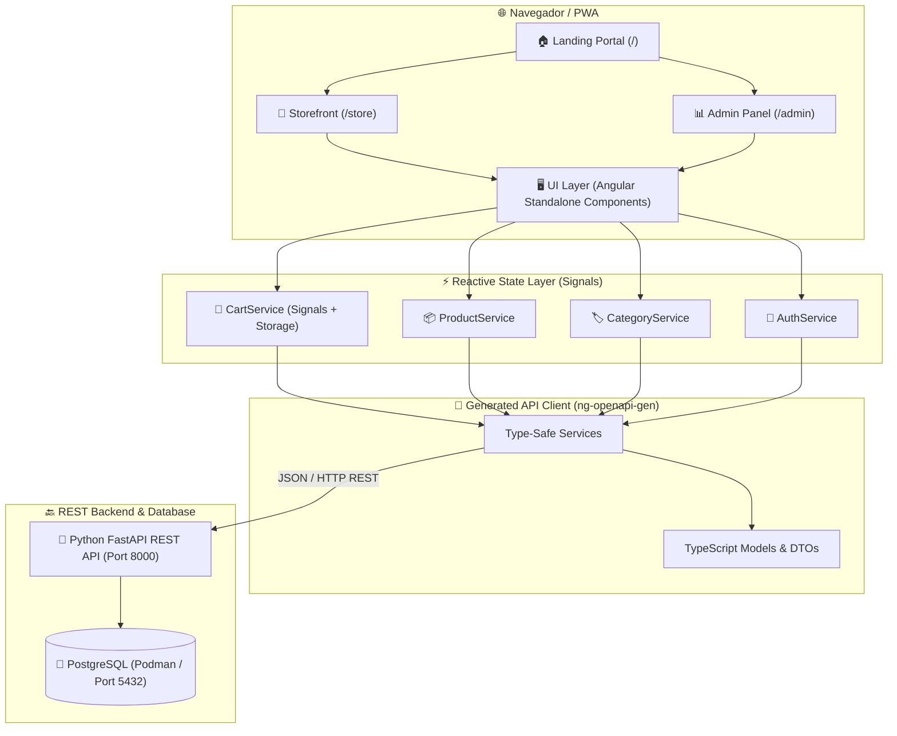

<div align="center">
  

  <p align="center">
    <a href="https://github.com/Paulob0t/PauloBot_Store_Front">
      
    </a>
    <a href="https://www.typescriptlang.org/">
      
    </a>
    <a href="https://tailwindcss.com/">
      
    </a>
    <a href="https://vite.dev/">
      
    </a>
    <a href="https://swagger.io/">
      
    </a>
    <a href="https://podman.io/">
      
    </a>
  </p>

  <p align="center">
    <strong>Plataforma frontend desacoplada de alto rendimiento para tiendas de autoservicio inteligente (Vending Machines) y punto de venta eCommerce.</strong>
  </p>
</div>

<br />

---

## 🌟 Características Principales

- ⚡ **Angular 22 Standalone Architecture:** Componentes independientes, carga diferida (*Lazy Loading*) y cero sobrecarga de `NgModules`.
- 🔄 **Gestión de Estado Reactiva con Signals:** Reactividad nativa ultrarrápida con `signal()`, `computed()` y `effect()` para carrito de compras, catálogo de productos y filtros.
- 🎨 **Estilizado Moderno con Tailwind CSS v4:** Motor de estilos ultra ligero con temas fluidos, animaciones suaves y diseño *Mobile-First*.
- 🛒 **Storefront Interactivo:**
  - **Hero Banner:** Bienvenida comercial con atención 24/7.
  - **Carrusel de Destacados:** Auto-desplazamiento suave con pausa interactiva al tocar o pasar el cursor.
  - **Carrusel Infinito de Categorías:** Navegación circular sin fin con scroll optimizado.
  - **Drawer de Carrito Reactivo:** Modificación instantánea de cantidades y cálculo de total en tiempo real.
- 📊 **Panel Administrativo Completo:**
  - Dashboard interactivo con métricas clave (KPIs) y gráficos de ventas de los últimos 7 días.
  - ABM completo de Productos, Categorías y Subcategorías.
  - Control de Cortes de Caja, Gestión de Usuarios y Consulta de Movimientos.
- 🔌 **Generación de Clientes API Type-Safe:** Integración con Swagger/OpenAPI mediante `ng-openapi-gen` para tipado estricto extremo con el Backend.

---

## 🏛️ Arquitectura del Sistema



---

## 📂 Estructura del Directorio

```text
PauloBot_Store_front/
├── public/                     # Recursos estáticos públicos (logos, iconos)
├── src/
│   ├── app/
│   │   ├── api/                # Clientes y DTOs generados por OpenAPI
│   │   │   ├── fn/             # Funciones de consulta a endpoints
│   │   │   ├── models/         # Interfaces de datos TypeScript
│   │   │   └── services/       # Servicios inyectables de API
│   │   ├── components/         # Componentes UI reutilizables
│   │   │   ├── banner/         # Hero banner del storefront
│   │   │   ├── carousel/       # Carrusel infinito de categorías & destacados
│   │   │   ├── cart-drawer/    # Drawer lateral de carrito de compras
│   │   │   └── header/         # Barra superior de navegación y búsqueda
│   │   ├── pages/              # Vistas y Rutas principales
│   │   │   ├── admin/          # Módulos del panel administrativo
│   │   │   │   ├── cash-register/  # Control y cortes de caja
│   │   │   │   ├── categories/     # Gestión de categorías y subcategorías
│   │   │   │   ├── dashboard/      # Dashboard con métricas y gráficas
│   │   │   │   ├── movements/      # Historial de ventas y movimientos
│   │   │   │   ├── products/       # Alta, edición y listado de productos
│   │   │   │   └── users/          # Administración de usuarios
│   │   │   ├── home/           # Pantalla de bienvenida / selector de portal
│   │   │   └── store/          # Catálogo principal de la tienda vending
│   │   ├── services/           # Servicios de estado reactivo (Signals)
│   │   ├── app.config.ts       # Configuración global de Angular & Providers
│   │   └── app.routes.ts       # Definición de rutas y Lazy Loading
│   ├── assets/                 # Imágenes y recursos multimedia
│   ├── main.ts                 # Punto de entrada de la aplicación
│   └── styles.css              # Configuración y directivas de Tailwind CSS v4
├── angular.json                # Configuración de compilación y dev-server
├── package.json                # Dependencias y scripts del proyecto
└── tsconfig.json               # Configuración del compilador TypeScript
```

---

## 🗺️ Mapa de Rutas de la Aplicación

| Ruta | Componente | Descripción |
| :--- | :--- | :--- |
| `/` | `HomeComponent` | Pantalla de inicio para seleccionar portal (Tienda o Admin). |
| `/store` | `StoreComponent` | Tienda interactiva con catálogo, filtros, carrusel y carrito. |
| `/login` | `LoginComponent` | Autenticación y acceso al panel de administración. |
| `/admin` | `DashboardComponent` | Panel de control con métricas en tiempo real y KPIs. |
| `/admin/productos` | `ProductListComponent` | Catálogo administrativo de inventario y productos. |
| `/admin/productos/nuevo`| `ProductFormComponent` | Formulario para agregar / editar productos con subida de imagen. |
| `/admin/categorias` | `CategoryListComponent`| Gestión integral de categorías comerciales. |
| `/admin/subcategorias`| `SubcategoryListComponent`| Control de subcategorías vinculadas. |
| `/admin/movimientos` | `MovementListComponent`| Auditoría y consulta de tickets y ventas realizadas. |
| `/admin/cortes-caja` | `CashRegisterComponent`| Control de aperturas, retiros y cortes de caja. |
| `/admin/usuarios` | `UserListComponent` | Gestión de cuentas y privilegios de usuarios. |
| `/admin/configuracion`| `CompanyConfigComponent`| Parámetros generales y datos de la empresa. |

---

## 🚀 Instalación y Puesta en Marcha

### 1. Clonar el repositorio
```bash
git clone git@github.com:Paulob0t/PauloBot_Store_Front.git
cd PauloBot_Store_Front
```

### 2. Instalar dependencias
```bash
npm install
# o si usas pnpm:
pnpm install
```

### 3. Iniciar el servidor de desarrollo
```bash
npm start
```
El frontend estará disponible en `http://localhost:4200/` con recarga en caliente automática (*HMR / Live-Reload*).

### 4. Regenerar servicios API TypeScript (OpenAPI)
Si actualizaste endpoints en el backend, puedes sincronizar los contratos de datos automáticamente:
```bash
npm run api:generate:remote
```

---

## 🛠️ Tech Stack

<div align="left">

| Tecnología | Descripción |
| :--- | :--- |
| **Angular 22** | Framework frontend de última generación con soporte nativo de Standalone Components y Signals. |
| **TypeScript 6.0** | Tipado estático robusto y contratos de interfaz estrictos. |
| **Tailwind CSS v4** | Utilidades CSS atómicas ultrarrápidas para diseño responsivo moderno. |
| **Vite / Angular Build** | Compilador y empaquetador ultrarrápido con soporte ESNext. |
| **OpenAPI / Swagger** | Generación automatizada de clientes de red HTTP mediante `ng-openapi-gen`. |
| **RxJS & Angular Signals** | Manejo de flujos asíncronos y reactividad fina sin fugas de memoria. |

</div>

---

<div align="center">
  <sub>Desarrollado con ❤️ y Clean Code por <a href="https://github.com/Paulob0t"><strong>Paulo Essau (Paulob0t)</strong></a></sub>
</div>
